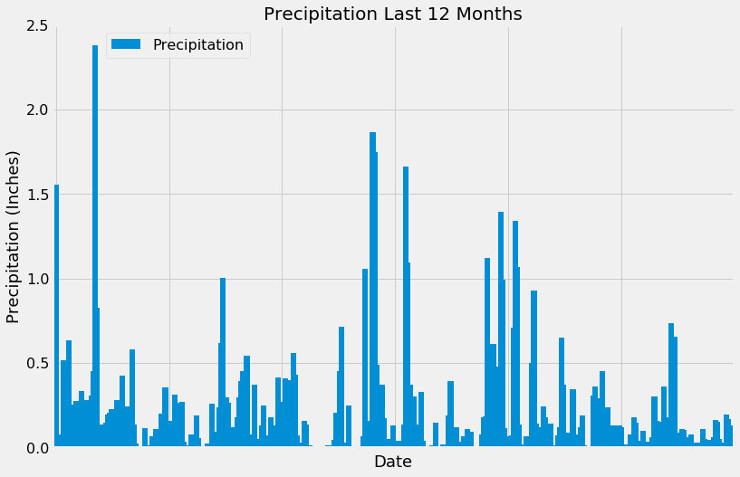
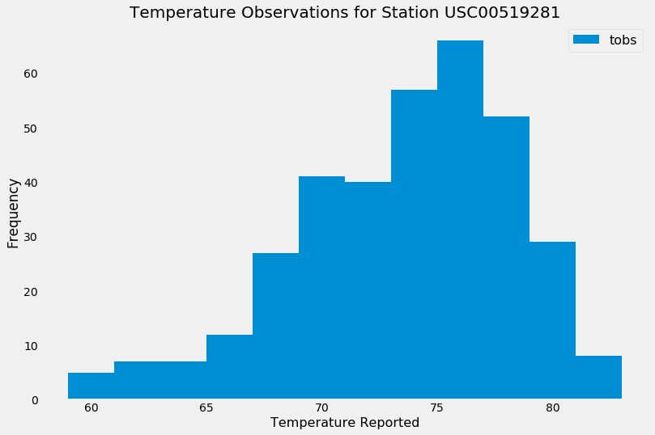
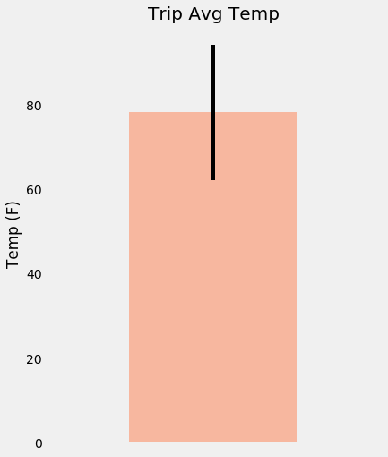
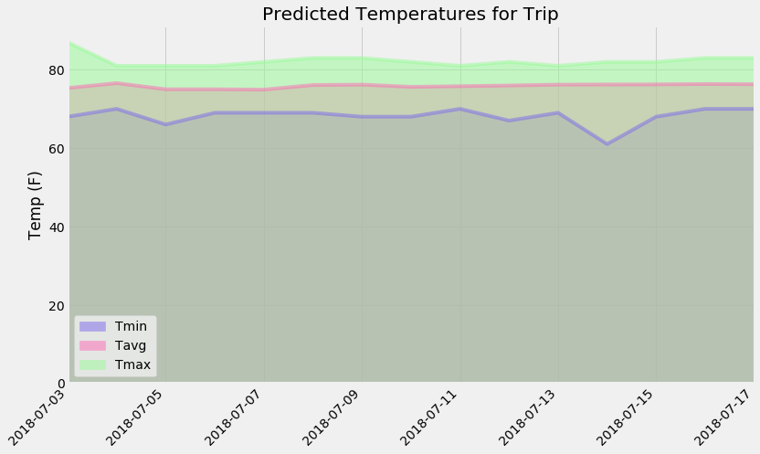

# Surfs Up!


Congratulations! You've decided to treat yourself to a long holiday vacation in Honolulu, Hawaii! To help with your trip planning, you need to do some climate analysis on the area. The following outlines what you need to do.

## Step 1 - Climate Analysis and Exploration

To begin, use Python and SQLAlchemy to do basic climate analysis and data exploration of your climate database. All of the following analysis should be completed using SQLAlchemy ORM queries, Pandas, and Matplotlib.

* Use the provided [starter notebook](climate_starter.ipynb) and [hawaii.sqlite](hawaii.sqlite) files to complete your climate analysis and data exploration.

* Choose a start date and end date for your trip. Make sure that your vacation range is approximately 3-15 days total.

* Use SQLAlchemy `create_engine` to connect to your sqlite database.

* Use SQLAlchemy `automap_base()` to reflect your tables into classes and save a reference to those classes called `Station` and `Measurement`.

### Precipitation Analysis

* Design a query to retrieve the last 12 months of precipitation data.

* Select only the `date` and `prcp` values.

* Load the query results into a Pandas DataFrame and set the index to the date column.

* Sort the DataFrame values by `date`.

* Plot the results using the DataFrame `plot` method.

  

* Use Pandas to print the summary statistics for the precipitation data.

### Station Analysis

* Design a query to calculate the total number of stations.

* Design a query to find the most active stations.

  * List the stations and observation counts in descending order.

  * Which station has the highest number of observations?

  * Hint: You may need to use functions such as `func.min`, `func.max`, `func.avg`, and `func.count` in your queries.

* Design a query to retrieve the last 12 months of temperature observation data (tobs).

  * Filter by the station with the highest number of observations.

  * Plot the results as a histogram with `bins=12`.

    

### Temperature Analysis (Optional)

* The starter notebook contains a function called `calc_temps` that will accept a start date and end date in the format `%Y-%m-%d` and return the minimum, average, and maximum temperatures for that range of dates.

* Use the `calc_temps` function to calculate the min, avg, and max temperatures for your trip using the matching dates from the previous year (i.e., use "2017-01-01" if your trip start date was "2018-01-01").

* Plot the min, avg, and max temperature from your previous query as a bar chart.

  * Use the average temperature as the bar height.

  * Use the peak-to-peak (tmax-tmin) value as the y error bar (yerr).

    

### Other Recommended Analysis (Optional)

* The following are optional challenge queries. These are highly recommended to attempt, but not required for the homework.

  * Calculate the rainfall per weather station using the previous year's matching dates.

* Calculate the daily normals. Normals are the averages for the min, avg, and max temperatures.

  * You are provided with a function called `daily_normals` that will calculate the daily normals for a specific date. This date string will be in the format `%m-%d`. Be sure to use all historic tobs that match that date string.

  * Create a list of dates for your trip in the format `%m-%d`. Use the `daily_normals` function to calculate the normals for each date string and append the results to a list.

  * Load the list of daily normals into a Pandas DataFrame and set the index equal to the date.

  * Use Pandas to plot an area plot (`stacked=False`) for the daily normals.

    

- - -

## Step 2 - Climate App

Now that you have completed your initial analysis, design a Flask API based on the queries that you have just developed.

* Use FLASK to create your routes.

### Routes

* `/`

  * Home page.

  * List all routes that are available.

* `/api/v1.0/precipitation`

  * Convert the query results to a Dictionary using `date` as the key and `prcp` as the value.

  * Return the JSON representation of your dictionary.

* `/api/v1.0/stations`

  * Return a JSON list of stations from the dataset.

* `/api/v1.0/tobs`
  * query for the dates and temperature observations from a year from the last data point.
  * Return a JSON list of Temperature Observations (tobs) for the previous year.

* `/api/v1.0/<start>` and `/api/v1.0/<start>/<end>`

  * Return a JSON list of the minimum temperature, the average temperature, and the max temperature for a given start or start-end range.

  * When given the start only, calculate `TMIN`, `TAVG`, and `TMAX` for all dates greater than and equal to the start date.

  * When given the start and the end date, calculate the `TMIN`, `TAVG`, and `TMAX` for dates between the start and end date inclusive.

## Hints

* You will need to join the station and measurement tables for some of the analysis queries.

* Use Flask `jsonify` to convert your API data into a valid JSON response object.

## Copyright

Data Boot Camp ©2018. All Rights Reserved.

# Dependencies import

import numpy as np
import pandas as pd
import datetime as dt
import sqlalchemy
import matplotlib.pyplot as plt
from matplotlib import style
%matplotlib inline

style.use('seaborn')
style.use('fivethirtyeight')

from sqlalchemy.ext.automap import automap_base
from sqlalchemy.orm import Session
from sqlalchemy import Column, Integer, String, Float, Text, ForeignKey, create_engine, inspect, func

from flask import Flask
app = Flask(__name__)


```python
%matplotlib inline
from matplotlib import style
style.use('fivethirtyeight')
import matplotlib.pyplot as plt
```


```python
import numpy as np
import pandas as pd
```


```python
import datetime as dt

```

# Reflect Tables into SQLAlchemy ORM


```python
# Python SQL toolkit and Object Relational Mapper
import sqlalchemy
from sqlalchemy.ext.automap import automap_base
from sqlalchemy.orm import Session
from sqlalchemy import create_engine, func
```


```python
engine = create_engine("sqlite:///Resources/hawaii.sqlite")
```


```python
# reflect an existing database into a new model
Base = automap_base()
# reflect the tables
Base.prepare(engine, reflect=True)
```


```python
# We can view all of the classes that automap found
Base.classes.keys()
```


    ['measurement', 'station']


```python
# Use `engine.execute` to select and display the first 10 rows from the measurement table
result = engine.execute("select *  from measurement").fetchall()
#engine.execute('select * from measurement').fetchall()
print(result[:10])
```

    [(1, 'USC00519397', '2010-01-01', 0.08, 65.0), (2, 'USC00519397', '2010-01-02', 0.0, 63.0), (3, 'USC00519397', '2010-01-03', 0.0, 74.0), (4, 'USC00519397', '2010-01-04', 0.0, 76.0), (5, 'USC00519397', '2010-01-06', None, 73.0), (6, 'USC00519397', '2010-01-07', 0.06, 70.0), (7, 'USC00519397', '2010-01-08', 0.0, 64.0), (8, 'USC00519397', '2010-01-09', 0.0, 68.0), (9, 'USC00519397', '2010-01-10', 0.0, 73.0), (10, 'USC00519397', '2010-01-11', 0.01, 64.0)]
    


```python
# Use `engine.execute` to select and display the first 10 rows from the measurement table
result = engine.execute("select *  from station").fetchall()
#engine.execute('select * from measurement').fetchall()
print(result[:10])
```

    [(1, 'USC00519397', 'WAIKIKI 717.2, HI US', 21.2716, -157.8168, 3.0), (2, 'USC00513117', 'KANEOHE 838.1, HI US', 21.4234, -157.8015, 14.6), (3, 'USC00514830', 'KUALOA RANCH HEADQUARTERS 886.9, HI US', 21.5213, -157.8374, 7.0), (4, 'USC00517948', 'PEARL CITY, HI US', 21.3934, -157.9751, 11.9), (5, 'USC00518838', 'UPPER WAHIAWA 874.3, HI US', 21.4992, -158.0111, 306.6), (6, 'USC00519523', 'WAIMANALO EXPERIMENTAL FARM, HI US', 21.33556, -157.71139, 19.5), (7, 'USC00519281', 'WAIHEE 837.5, HI US', 21.45167, -157.84888999999998, 32.9), (8, 'USC00511918', 'HONOLULU OBSERVATORY 702.2, HI US', 21.3152, -157.9992, 0.9), (9, 'USC00516128', 'MANOA LYON ARBO 785.2, HI US', 21.3331, -157.8025, 152.4)]
    


```python
# Save references to each table
Measurement = Base.classes.measurement
Station = Base.classes.station
```


```python
# Reflect Database into ORM class
Base = automap_base()
Base.prepare(engine, reflect=True)
Measurement = Base.classes.measurement
Station = Base.classes.station
```


```python
# Create our session (link) from Python to the DB
session = Session(engine)
```


```python
first_row = session.query(Measurement).first()
first_row.__dict__
```


    {'_sa_instance_state': <sqlalchemy.orm.state.InstanceState at 0x175ce5cd518>,
     'date': '2010-01-01',
     'id': 1,
     'prcp': 0.08,
     'station': 'USC00519397',
     'tobs': 65.0}


```python
# Find the number of Measurement from the USA
usa = session.query(Measurement).filter(Measurement.station == 'USC00519397').count()
print("There are {} station from the USC00519397".format(usa))
```

    There are 2724 station from the USC00519397
    


```python
# Query Measurement for id`, `station`, date, prcp, tobs and `data` and save the query into results
id=[]
station=[]
date=[]
prcp=[]
tobs=[]
data=[]
for row in session.query(Measurement.id, Measurement.station, Measurement.date, Measurement.prcp, Measurement.tobs).all():
    id.append(row[0])
    station.append(row[1])
    date.append(row[2])
    prcp.append(row[3])
    tobs.append(row[4])
```


```python
engine.execute('SELECT * FROM measurement LIMIT 5').fetchall()
```


    [(1, 'USC00519397', '2010-01-01', 0.08, 65.0),
     (2, 'USC00519397', '2010-01-02', 0.0, 63.0),
     (3, 'USC00519397', '2010-01-03', 0.0, 74.0),
     (4, 'USC00519397', '2010-01-04', 0.0, 76.0),
     (5, 'USC00519397', '2010-01-06', None, 73.0)]


# Exploratory Climate Analysis


```python
# Earliest Date
session.query(Measurement.date).order_by(Measurement.date).first().date
```


    '2010-01-01'


```python
date_start = session.query(Measurement.date).order_by(Measurement.date).first().date
date_start
```


    '2010-01-01'


```python
# Latest Date
latest_date = session.query(Measurement.date).order_by(Measurement.date.desc()).first().date
latest_date
```


    '2017-08-23'


```python
date_end = latest_date = session.query(Measurement.date).order_by(Measurement.date.desc()).first().date
latest_date
```


    '2017-08-23'


```python
# Date 12 months from the latest date
last_twelve_months = dt.datetime.strptime(latest_date, '%Y-%m-%d') - dt.timedelta(days=365)
last_twelve_months
```


    datetime.datetime(2016, 8, 23, 0, 0)


```python
first_day = dt.datetime.strptime(latest_date, '%Y-%m-%d') - dt.timedelta(days=-730)
first_day
```


    datetime.datetime(2019, 8, 23, 0, 0)


```python
# Retrieve the last 12 months of precipitation data
p_results = session.query(Measurement.date, func.avg(Measurement.prcp)).\
                    filter(Measurement.date >= last_twelve_months).\
                    group_by(Measurement.date).all()
p_results
```


    [('2016-08-24', 1.5549999999999997),
     ('2016-08-25', 0.07714285714285715),
     ('2016-08-26', 0.016666666666666666),
     ('2016-08-27', 0.06399999999999999),
     ('2016-08-28', 0.5166666666666666),
     ('2016-08-29', 0.24333333333333332),
     ('2016-08-30', 0.011666666666666667),
     ('2016-08-31', 0.6359999999999999),
     ('2016-09-01', 0.006),
     ('2016-09-02', 0.05),
     ('2016-09-03', 0.254),
     ('2016-09-04', 0.276),
     ('2016-09-05', 0.08499999999999999),
     ('2016-09-06', 0.246),
     ('2016-09-07', 0.3333333333333333),
     ('2016-09-08', 0.07666666666666667),
     ('2016-09-09', 0.17833333333333332),
     ('2016-09-10', 0.27999999999999997),
     ('2016-09-11', 0.25),
     ('2016-09-12', 0.308),
     ('2016-09-13', 0.45166666666666666),
     ('2016-09-14', 2.3800000000000003),
     ('2016-09-15', 0.8266666666666667),
     ('2016-09-16', 0.11714285714285715),
     ('2016-09-17', 0.13599999999999998),
     ('2016-09-18', 0.10600000000000001),
     ('2016-09-19', 0.064),
     ('2016-09-20', 0.14714285714285716),
     ('2016-09-21', 0.19499999999999998),
     ('2016-09-22', 0.2057142857142857),
     ('2016-09-23', 0.22428571428571428),
     ('2016-09-24', 0.04666666666666667),
     ('2016-09-25', 0.015),
     ('2016-09-26', 0.2783333333333333),
     ('2016-09-27', 0.22666666666666666),
     ('2016-09-28', 0.018571428571428572),
     ('2016-09-29', 0.42714285714285716),
     ('2016-09-30', 0.19166666666666665),
     ('2016-10-01', 0.2416666666666667),
     ('2016-10-02', 0.12),
     ('2016-10-03', 0.115),
     ('2016-10-04', 0.5816666666666667),
     ('2016-10-05', 0.1366666666666667),
     ('2016-10-06', 0.022857142857142857),
     ('2016-10-07', 0.0016666666666666668),
     ('2016-10-08', 0.008),
     ('2016-10-09', 0.0),
     ('2016-10-10', 0.0),
     ('2016-10-11', 0.11499999999999999),
     ('2016-10-12', 0.013333333333333334),
     ('2016-10-13', 0.013333333333333334),
     ('2016-10-14', 0.0),
     ('2016-10-15', 0.065),
     ('2016-10-16', 0.0),
     ('2016-10-17', 0.11000000000000001),
     ('2016-10-18', 0.09999999999999999),
     ('2016-10-19', 0.028333333333333332),
     ('2016-10-20', 0.202),
     ('2016-10-21', 0.064),
     ('2016-10-22', 0.354),
     ('2016-10-23', 0.055999999999999994),
     ('2016-10-24', 0.13166666666666665),
     ('2016-10-25', 0.15714285714285717),
     ('2016-10-26', 0.04833333333333334),
     ('2016-10-27', 0.31),
     ('2016-10-28', 0.09500000000000001),
     ('2016-10-29', 0.10666666666666667),
     ('2016-10-30', 0.26499999999999996),
     ('2016-10-31', 0.26833333333333337),
     ('2016-11-01', 0.035),
     ('2016-11-02', 0.006666666666666667),
     ('2016-11-03', 0.0033333333333333335),
     ('2016-11-04', 0.01),
     ('2016-11-05', 0.075),
     ('2016-11-06', 0.013333333333333334),
     ('2016-11-07', 0.03),
     ('2016-11-08', 0.18666666666666668),
     ('2016-11-09', 0.05714285714285714),
     ('2016-11-10', 0.0016666666666666668),
     ('2016-11-11', 0.0),
     ('2016-11-12', 0.0),
     ('2016-11-13', 0.0),
     ('2016-11-14', 0.02142857142857143),
     ('2016-11-15', 0.008333333333333333),
     ('2016-11-16', 0.25666666666666665),
     ('2016-11-17', 0.01),
     ('2016-11-18', 0.0075),
     ('2016-11-19', 0.095),
     ('2016-11-20', 0.23750000000000002),
     ('2016-11-21', 0.616),
     ('2016-11-22', 1.002),
     ('2016-11-23', 0.134),
     ('2016-11-24', 0.296),
     ('2016-11-25', 0.264),
     ('2016-11-26', 0.085),
     ('2016-11-27', 0.09166666666666667),
     ('2016-11-28', 0.12),
     ('2016-11-29', 0.07166666666666667),
     ('2016-11-30', 0.17666666666666667),
     ('2016-12-01', 0.295),
     ('2016-12-02', 0.3933333333333333),
     ('2016-12-03', 0.45166666666666666),
     ('2016-12-04', 0.13333333333333333),
     ('2016-12-05', 0.54),
     ('2016-12-06', 0.008),
     ('2016-12-07', 0.076),
     ('2016-12-08', 0.06571428571428573),
     ('2016-12-09', 0.37),
     ('2016-12-10', 0.026000000000000002),
     ('2016-12-11', 0.05),
     ('2016-12-12', 0.008333333333333333),
     ('2016-12-13', 0.12833333333333333),
     ('2016-12-14', 0.25),
     ('2016-12-15', 0.043333333333333335),
     ('2016-12-16', 0.006666666666666667),
     ('2016-12-17', 0.07),
     ('2016-12-18', 0.178),
     ('2016-12-19', 0.07),
     ('2016-12-20', 0.005),
     ('2016-12-21', 0.1285714285714286),
     ('2016-12-22', 0.4116666666666666),
     ('2016-12-23', 0.205),
     ('2016-12-24', 0.27),
     ('2016-12-25', 0.086),
     ('2016-12-26', 0.40800000000000003),
     ('2016-12-27', 0.04),
     ('2016-12-28', 0.06833333333333334),
     ('2016-12-29', 0.39666666666666667),
     ('2016-12-30', 0.5583333333333333),
     ('2016-12-31', 0.42800000000000005),
     ('2017-01-01', 0.06999999999999999),
     ('2017-01-02', 0.004),
     ('2017-01-03', 0.0),
     ('2017-01-04', 0.03),
     ('2017-01-05', 0.15833333333333333),
     ('2017-01-06', 0.13333333333333333),
     ('2017-01-07', 0.01),
     ('2017-01-08', 0.01),
     ('2017-01-09', 0.0),
     ('2017-01-10', 0.0),
     ('2017-01-11', 0.0),
     ('2017-01-12', 0.0),
     ('2017-01-13', 0.0),
     ('2017-01-14', 0.002),
     ('2017-01-15', 0.0025),
     ('2017-01-16', 0.0),
     ('2017-01-17', 0.0),
     ('2017-01-18', 0.011666666666666667),
     ('2017-01-19', 0.0033333333333333335),
     ('2017-01-20', 0.0),
     ('2017-01-21', 0.04666666666666666),
     ('2017-01-22', 0.20400000000000001),
     ('2017-01-23', 0.188),
     ('2017-01-24', 0.45),
     ('2017-01-25', 0.716),
     ('2017-01-26', 0.015714285714285715),
     ('2017-01-27', 0.008571428571428572),
     ('2017-01-28', 0.028000000000000004),
     ('2017-01-29', 0.2475),
     ('2017-01-30', 0.008333333333333333),
     ('2017-01-31', 0.0),
     ('2017-02-01', 0.0),
     ('2017-02-02', 0.0),
     ('2017-02-03', 0.0),
     ('2017-02-04', 0.0),
     ('2017-02-05', 0.0),
     ('2017-02-06', 0.06333333333333334),
     ('2017-02-07', 1.0571428571428572),
     ('2017-02-08', 0.1542857142857143),
     ('2017-02-09', 0.002857142857142857),
     ('2017-02-10', 0.0),
     ('2017-02-11', 1.866666666666667),
     ('2017-02-12', 1.7466666666666668),
     ('2017-02-13', 0.4866666666666666),
     ('2017-02-14', 0.0016666666666666668),
     ('2017-02-15', 0.016),
     ('2017-02-16', 0.36999999999999994),
     ('2017-02-17', 0.17500000000000004),
     ('2017-02-18', 0.0025),
     ('2017-02-19', 0.0475),
     ('2017-02-20', 0.0),
     ('2017-02-21', 0.026000000000000002),
     ('2017-02-22', 0.13000000000000003),
     ('2017-02-23', 0.0014285714285714286),
     ('2017-02-24', 0.0),
     ('2017-02-25', 0.0375),
     ('2017-02-26', 0.0),
     ('2017-02-27', 0.0),
     ('2017-02-28', 0.13666666666666666),
     ('2017-03-01', 1.6600000000000001),
     ('2017-03-02', 1.0933333333333333),
     ('2017-03-03', 0.37166666666666665),
     ('2017-03-04', 0.0),
     ('2017-03-05', 0.3025),
     ('2017-03-06', 0.135),
     ('2017-03-07', 0.0),
     ('2017-03-08', 0.0),
     ('2017-03-09', 0.3266666666666667),
     ('2017-03-10', 0.04142857142857143),
     ('2017-03-11', 0.008),
     ('2017-03-12', 0.0),
     ('2017-03-13', 0.0),
     ('2017-03-14', 0.008571428571428572),
     ('2017-03-15', 0.01),
     ('2017-03-16', 0.0),
     ('2017-03-17', 0.144),
     ('2017-03-18', 0.0),
     ('2017-03-19', 0.0),
     ('2017-03-20', 0.004),
     ('2017-03-21', 0.015),
     ('2017-03-22', 0.0),
     ('2017-03-23', 0.008333333333333333),
     ('2017-03-24', 0.18833333333333335),
     ('2017-03-25', 0.394),
     ('2017-03-26', 0.0),
     ('2017-03-27', 0.002),
     ('2017-03-28', 0.11833333333333335),
     ('2017-03-29', 0.03166666666666667),
     ('2017-03-30', 0.03),
     ('2017-03-31', 0.0016666666666666668),
     ('2017-04-01', 0.06833333333333334),
     ('2017-04-02', 0.0),
     ('2017-04-03', 0.11),
     ('2017-04-04', 0.02142857142857143),
     ('2017-04-05', 0.09428571428571429),
     ('2017-04-06', 0.008571428571428572),
     ('2017-04-07', 0.0),
     ('2017-04-08', 0.0),
     ('2017-04-09', 0.0),
     ('2017-04-10', 0.0033333333333333335),
     ('2017-04-11', 0.07833333333333332),
     ('2017-04-12', 0.18000000000000002),
     ('2017-04-13', 0.18166666666666667),
     ('2017-04-14', 1.1199999999999999),
     ('2017-04-15', 0.34800000000000003),
     ('2017-04-16', 0.21400000000000002),
     ('2017-04-17', 0.6140000000000001),
     ('2017-04-18', 0.48),
     ('2017-04-19', 0.03333333333333333),
     ('2017-04-20', 0.13),
     ('2017-04-21', 1.3966666666666667),
     ('2017-04-22', 0.9920000000000002),
     ('2017-04-23', 0.11499999999999999),
     ('2017-04-24', 0.015000000000000001),
     ('2017-04-25', 0.0),
     ('2017-04-26', 0.065),
     ('2017-04-27', 0.06999999999999999),
     ('2017-04-28', 0.7066666666666667),
     ('2017-04-29', 1.3399999999999999),
     ('2017-04-30', 1.07),
     ('2017-05-01', 0.135),
     ('2017-05-02', 0.008333333333333333),
     ('2017-05-03', 0.006),
     ('2017-05-04', 0.016),
     ('2017-05-05', 0.06333333333333334),
     ('2017-05-06', 0.01),
     ('2017-05-07', 0.024),
     ('2017-05-08', 0.5016666666666666),
     ('2017-05-09', 0.9260000000000002),
     ('2017-05-10', 0.14333333333333334),
     ('2017-05-11', 0.12),
     ('2017-05-12', 0.032),
     ('2017-05-13', 0.048),
     ('2017-05-14', 0.244),
     ('2017-05-15', 0.176),
     ('2017-05-16', 0.06999999999999999),
     ('2017-05-17', 0.025000000000000005),
     ('2017-05-18', 0.14166666666666666),
     ('2017-05-19', 0.01),
     ('2017-05-20', 0.0075),
     ('2017-05-21', 0.002),
     ('2017-05-22', 0.072),
     ('2017-05-23', 0.11833333333333333),
     ('2017-05-24', 0.6483333333333333),
     ('2017-05-25', 0.37000000000000005),
     ('2017-05-26', 0.004),
     ('2017-05-27', 0.085),
     ('2017-05-28', 0.06833333333333334),
     ('2017-05-29', 0.084),
     ('2017-05-30', 0.346),
     ('2017-05-31', 0.074),
     ('2017-06-01', 0.006666666666666667),
     ('2017-06-02', 0.06799999999999999),
     ('2017-06-03', 0.122),
     ('2017-06-04', 0.19166666666666665),
     ('2017-06-05', 0.013333333333333334),
     ('2017-06-06', 0.0),
     ('2017-06-07', 0.0016666666666666668),
     ('2017-06-08', 0.005),
     ('2017-06-09', 0.008),
     ('2017-06-10', 0.306),
     ('2017-06-11', 0.35833333333333334),
     ('2017-06-12', 0.2916666666666667),
     ('2017-06-13', 0.22999999999999998),
     ('2017-06-14', 0.26166666666666666),
     ('2017-06-15', 0.45166666666666666),
     ('2017-06-16', 0.03333333333333333),
     ('2017-06-17', 0.09000000000000001),
     ('2017-06-18', 0.23666666666666666),
     ('2017-06-19', 0.12166666666666666),
     ('2017-06-20', 0.11000000000000001),
     ('2017-06-21', 0.1275),
     ('2017-06-22', 0.07333333333333335),
     ('2017-06-23', 0.11166666666666665),
     ('2017-06-24', 0.128),
     ('2017-06-25', 0.12),
     ('2017-06-26', 0.02),
     ('2017-06-27', 0.018333333333333333),
     ('2017-06-28', 0.005),
     ('2017-06-29', 0.011666666666666667),
     ('2017-06-30', 0.07428571428571429),
     ('2017-07-01', 0.065),
     ('2017-07-02', 0.18),
     ('2017-07-03', 0.148),
     ('2017-07-04', 0.037500000000000006),
     ('2017-07-05', 0.0),
     ('2017-07-06', 0.004),
     ('2017-07-07', 0.1),
     ('2017-07-08', 0.016666666666666666),
     ('2017-07-09', 0.03333333333333333),
     ('2017-07-10', 0.006666666666666667),
     ('2017-07-11', 0.005),
     ('2017-07-12', 0.060000000000000005),
     ('2017-07-13', 0.3016666666666667),
     ('2017-07-14', 0.15833333333333335),
     ('2017-07-15', 0.03166666666666667),
     ('2017-07-16', 0.135),
     ('2017-07-17', 0.15166666666666667),
     ('2017-07-18', 0.3614285714285714),
     ('2017-07-19', 0.06833333333333334),
     ('2017-07-20', 0.17714285714285713),
     ('2017-07-21', 0.018571428571428572),
     ('2017-07-22', 0.7366666666666667),
     ('2017-07-23', 0.22600000000000003),
     ('2017-07-24', 0.6539999999999999),
     ('2017-07-25', 0.08714285714285715),
     ('2017-07-26', 0.08333333333333333),
     ('2017-07-27', 0.0016666666666666668),
     ('2017-07-28', 0.11),
     ('2017-07-29', 0.10166666666666667),
     ('2017-07-30', 0.06),
     ('2017-07-31', 0.0),
     ('2017-08-01', 0.04666666666666666),
     ('2017-08-02', 0.075),
     ('2017-08-03', 0.017499999999999998),
     ('2017-08-04', 0.015),
     ('2017-08-05', 0.03),
     ('2017-08-06', 0.0),
     ('2017-08-07', 0.0125),
     ('2017-08-08', 0.11000000000000001),
     ('2017-08-09', 0.049999999999999996),
     ('2017-08-10', 0.0175),
     ('2017-08-11', 0.0),
     ('2017-08-12', 0.04666666666666667),
     ('2017-08-13', 0.0),
     ('2017-08-14', 0.062),
     ('2017-08-15', 0.164),
     ('2017-08-16', 0.1525),
     ('2017-08-17', 0.0475),
     ('2017-08-18', 0.02),
     ('2017-08-19', 0.03),
     ('2017-08-20', 0.005),
     ('2017-08-21', 0.19333333333333336),
     ('2017-08-22', 0.16666666666666666),
     ('2017-08-23', 0.1325)]


```python
# Put data into dataframe
precipitation_df = pd.DataFrame(p_results, columns=['Date', 'Precipitation'])
precipitation_df.set_index('Date', inplace=True)
precipitation_df.head()
```


<div>
<style scoped>
    .dataframe tbody tr th:only-of-type {
        vertical-align: middle;
    }

    .dataframe tbody tr th {
        vertical-align: top;
    }

    .dataframe thead th {
        text-align: right;
    }
</style>
<table border="1" class="dataframe">
  <thead>
    <tr style="text-align: right;">
      <th></th>
      <th>Precipitation</th>
    </tr>
    <tr>
      <th>Date</th>
      <th></th>
    </tr>
  </thead>
  <tbody>
    <tr>
      <th>2016-08-24</th>
      <td>1.555000</td>
    </tr>
    <tr>
      <th>2016-08-25</th>
      <td>0.077143</td>
    </tr>
    <tr>
      <th>2016-08-26</th>
      <td>0.016667</td>
    </tr>
    <tr>
      <th>2016-08-27</th>
      <td>0.064000</td>
    </tr>
    <tr>
      <th>2016-08-28</th>
      <td>0.516667</td>
    </tr>
  </tbody>
</table>
</div>


```python
# Plot the precipitation for the past 12 months
ax = precipitation_df.plot(kind='bar', width=3, figsize=(12,8))
plt.locator_params(axis='x', nbins=6)
ax.xaxis.set_major_formatter(plt.NullFormatter())
ax.tick_params(axis='y', labelsize=16)
ax.grid(True)
plt.legend(bbox_to_anchor=(.3,1), fontsize="16")
plt.title("Precipitation Last 12 Months", size=20)
plt.ylabel("Precipitation (Inches)", size=18)
plt.xlabel("Date", size=18)
plt.savefig("../Precipitation.png")
plt.show
```


    <function matplotlib.pyplot.show(*args, **kw)>





```python
# Print the summary statistics for the precipitation data
precipitation_df.describe()
```


<div>
<style scoped>
    .dataframe tbody tr th:only-of-type {
        vertical-align: middle;
    }

    .dataframe tbody tr th {
        vertical-align: top;
    }

    .dataframe thead th {
        text-align: right;
    }
</style>
<table border="1" class="dataframe">
  <thead>
    <tr style="text-align: right;">
      <th></th>
      <th>Precipitation</th>
    </tr>
  </thead>
  <tbody>
    <tr>
      <th>count</th>
      <td>365.000000</td>
    </tr>
    <tr>
      <th>mean</th>
      <td>0.169987</td>
    </tr>
    <tr>
      <th>std</th>
      <td>0.295722</td>
    </tr>
    <tr>
      <th>min</th>
      <td>0.000000</td>
    </tr>
    <tr>
      <th>25%</th>
      <td>0.008571</td>
    </tr>
    <tr>
      <th>50%</th>
      <td>0.070000</td>
    </tr>
    <tr>
      <th>75%</th>
      <td>0.191667</td>
    </tr>
    <tr>
      <th>max</th>
      <td>2.380000</td>
    </tr>
  </tbody>
</table>
</div>


```python
# Calculate the total number of stations
session.query(Station.id).count()
```


    9


```python
# Design a query to find the most active stations.
# List the stations and observation counts in descending order
# Which station has the highest number of observations? - USC00519281 with 2772 observations
s_results = session.query(Measurement.station, func.count(Measurement.station)).\
            group_by(Measurement.station).\
            order_by(func.count(Measurement.station).desc()).all()
s_results
```


    [('USC00519281', 2772),
     ('USC00519397', 2724),
     ('USC00513117', 2709),
     ('USC00519523', 2669),
     ('USC00516128', 2612),
     ('USC00514830', 2202),
     ('USC00511918', 1979),
     ('USC00517948', 1372),
     ('USC00518838', 511)]


```python
# Using the station id from the previous query, calculate the lowest temperature recorded, 
# highest temperature recorded, and average temperature most active station?
best_station = s_results[0][0]
session.query(func.min(Measurement.tobs), func.avg(Measurement.tobs), func.max(Measurement.tobs)).\
                filter(Measurement.station == best_station).all()
```


    [(54.0, 71.66378066378067, 85.0)]


```python
# Choose the station with the highest number of temperature observations.
# Query the last 12 months of temperature observation data for this station and plot the results as a histogram
t_results = session.query(Measurement.station, Measurement.tobs).\
                filter(Measurement.station == best_station).\
                filter(Measurement.date >= last_twelve_months).all()
tobs_df = pd.DataFrame(t_results)
tobs_df.set_index('station', inplace=True)
tobs_df.head()
```


<div>
<style scoped>
    .dataframe tbody tr th:only-of-type {
        vertical-align: middle;
    }

    .dataframe tbody tr th {
        vertical-align: top;
    }

    .dataframe thead th {
        text-align: right;
    }
</style>
<table border="1" class="dataframe">
  <thead>
    <tr style="text-align: right;">
      <th></th>
      <th>tobs</th>
    </tr>
    <tr>
      <th>station</th>
      <th></th>
    </tr>
  </thead>
  <tbody>
    <tr>
      <th>USC00519281</th>
      <td>77.0</td>
    </tr>
    <tr>
      <th>USC00519281</th>
      <td>80.0</td>
    </tr>
    <tr>
      <th>USC00519281</th>
      <td>80.0</td>
    </tr>
    <tr>
      <th>USC00519281</th>
      <td>75.0</td>
    </tr>
    <tr>
      <th>USC00519281</th>
      <td>73.0</td>
    </tr>
  </tbody>
</table>
</div>


```python
# Plot the results as a histogram with bins=12.
tobs_df.plot.hist(by='station', bins=12, figsize=(12,8))
plt.grid()
plt.title("Temperature Observations for Station " + best_station, fontsize=20)
plt.xlabel("Temperature Reported", fontsize=16)
plt.legend(bbox_to_anchor=(1,1), fontsize=16)
plt.savefig("../StationTemps.png")
plt.show
```


    <function matplotlib.pyplot.show(*args, **kw)>





```python
# Write a function called calc_temps that will accept a start date and end date in the format %Y-%m-%d 
# and return the minimum, average, and maximum temperatures for that range of dates.
def calc_temps(start_date, end_date):
    c_results = session.query(func.min(Measurement.tobs), func.avg(Measurement.tobs), func.max(Measurement.tobs)).\
                    filter(Measurement.date >= start_date).\
                    filter(Measurement.date <= end_date).all()
    return c_results
calc_temps('2017-01-01', '2017-12-31')
```


    [(58.0, 74.14387974230493, 87.0)]


```python
# Use your previous function `calc_temps` to calculate the tmin, tavg, and tmax 
# for your trip using the previous year's data for those same dates.
trip_results = calc_temps('2017-07-02', '2017-07-08')
trip_results
```


    [(71.0, 78.11904761904762, 87.0)]


```python
# Plot the results from your previous query as a bar chart. 
# Use "Trip Avg Temp" as your Title
# Use the average temperature for the y value
# Use the peak-to-peak (tmax-tmin) value as the y error bar (yerr)
trip_df = pd.DataFrame(trip_results, columns=['Min Temp', 'Avg Temp', 'Max Temp'])
avg_temp = trip_df['Avg Temp']
min_max_temp = trip_df.iloc[0]['Max Temp'] - trip_df.iloc[0]['Min Temp']
avg_temp.plot(kind='bar', yerr=min_max_temp, figsize=(6,8), alpha=0.5, color='coral')
plt.title("Trip Avg Temp", fontsize=20)
plt.ylabel("Temp (F)")
plt.xticks([])
plt.grid()
plt.savefig("../TripTempSummary.png")
plt.show()
```





```python
'''Calculate the Daily Normals'''

#create a function called daily_normals that will calculate the daily normals for a specific date
def daily_normals(day_date):
    temps = session.query(func.min(Measurement.tobs), func.avg(Measurement.tobs), func.max(Measurement.tobs)).\
                          filter(func.strftime("%m-%d", msmt.date) == day_date).all()
    return temps
    
#create a list of dates for your trip 
last_twelve_months
```


    datetime.datetime(2016, 8, 23, 0, 0)


```python
'''Calculate the Daily Normals'''
#choose a start and end date for the trip
trip_start = dt.date(2018,7,3)
trip_end = dt.date(2018,7,17)
```


```python
#create a function called daily_normals that will calculate the daily normals for a specific date
def daily_normals(day_date):
    temps = session.query(func.min(Measurement.tobs), func.avg(Measurement.tobs), func.max(Measurement.tobs)).\
                          filter(func.strftime("%m-%d", Measurement.date) == day_date).all()
    return temps
    
#create a list of dates for your trip 
trip_dates = pd.date_range(trip_start, trip_end)

#format it to %m-%d
trip_mmdd = trip_dates.strftime('%m-%d')

#calculate the normals for each date string and append the results to a list
normals_list = []
for trip_date in trip_mmdd:
    #unpack daily_normals
    normals_list.append(*daily_normals(trip_date))

#make a df
normals_df = pd.DataFrame(normals_list, columns = ['Tmin', 'Tavg', 'Tmax'])

#make the trip dates the index
normals_df['Date'] = trip_dates
normals_df = normals_df.set_index('Date')

'''Area Plot'''

#make a colors list
colors = ['mediumslateblue', 'hotpink', 'palegreen']

#make an area plot for the predicted temps
normals_df.plot(kind='area', figsize=(12, 8), stacked=False, x_compat=True, color=colors, title='Predicted Temperatures for Trip', rot=45)

#make the labels
plt.xlabel('')
plt.ylabel('Temp (F)')

plt.show()
```



